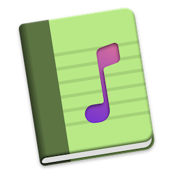

# LyricsX 菜单栏歌词版

这是一个基于 [LyricsX](https://github.com/ddddxxx/LyricsX) 的个人精简版 fork。原版 LyricsX 是功能完整的 macOS 歌词应用，包含桌面歌词、独立歌词窗口、Touch Bar 歌词和菜单栏歌词等显示方式；本版本只保留我长期使用的 **菜单栏歌词显示**，让应用尽量安静地留在菜单栏里工作。



## 当前定位

本项目不是完整 LyricsX 的替代品，而是一个自用取向的菜单栏歌词版本：

- 只在 macOS 菜单栏显示当前播放歌词
- 不再显示独立应用图标和桌面歌词窗口
- 点击菜单栏歌词即可打开菜单，进入偏好设置、搜索歌词或退出应用
- 关闭菜单栏歌词时，状态栏会退回默认应用图标，方便重新打开菜单
- 默认不打扰桌面，只保留歌词搜索、同步和菜单栏显示所需能力

## 主要功能

- 自动监听当前播放器和当前歌曲
- 自动搜索、下载并匹配同步歌词
- 搜索结果优先采用 **歌曲名 + 歌手 + 专辑** 完全一致的歌词
- 如果没有专辑信息，则优先采用 **歌曲名 + 歌手** 完全一致的歌词
- 当前歌曲暂无歌词时，菜单栏显式显示 `无可用歌词`
- 搜索过程中显示 `正在搜索歌词...`，避免误判为没有歌词
- 支持菜单栏歌词显示宽度设置，范围为 `60 px` 到 `240 px`
- 支持菜单栏菜单中调整歌词偏移
- 支持手动搜索歌词、标记错误歌词、打开歌词文件位置
- 支持繁简中文转换
- 支持随播放器启动或退出

## 支持的播放器

当前保留原项目的播放器适配能力，常见播放器包括：

- Apple Music / iTunes
- Spotify
- Vox
- Audirvana
- Swinsian

实际可用性取决于播放器本身的自动化权限、系统权限和 MusicPlayer 依赖的适配情况。

## 与原版的区别

本 fork 已移除或禁用以下显示能力：

- 桌面 Karaoke 歌词窗口
- 独立歌词 HUD 窗口
- Touch Bar 歌词
- 菜单栏中的独立应用图标常驻显示
- 与上述显示方式相关的偏好设置入口和快捷键入口

保留的核心链路是：

```text
播放器监听 -> 歌词搜索 -> 歌词匹配 -> 同步播放进度 -> 菜单栏显示
```

## 系统要求

- macOS 11 或更高版本建议使用
- Xcode 26 或兼容的完整 Xcode 环境
- 可用于本机签名的 Apple ID / Personal Team

项目文件中部分 target 的最低系统版本仍沿用原项目设置；本 fork 主要在个人 macOS 环境中构建和使用。

## 构建前准备

首次构建前，请在 Xcode 中完成签名设置：

1. 打开 `LyricsX.xcodeproj`
2. 登录自己的 Apple ID
3. 为 `LyricsX` 和 `LyricsXHelper` 两个 target 选择自己的 Team
4. 如需改成自己的 Bundle Identifier，请同时修改主程序和 Helper

本 fork 当前使用：

```text
Team ID: 85WF7CFPKM
主程序 Bundle ID: com.nabian.LyricsX
Helper Bundle ID: com.nabian.LyricsXHelper
```

如果你直接使用自己的 Apple ID 构建，建议把 Bundle Identifier 改成自己的反向域名，例如：

```text
com.yourname.LyricsX
com.yourname.LyricsXHelper
```

## 构建命令

Debug 构建：

```bash
xcodebuild -project LyricsX.xcodeproj \
  -scheme LyricsX \
  -configuration Debug \
  -skipMacroValidation \
  -skipPackagePluginValidation \
  build
```

Release 构建：

```bash
xcodebuild -project LyricsX.xcodeproj \
  -scheme LyricsX \
  -configuration Release \
  -skipMacroValidation \
  -skipPackagePluginValidation \
  build
```

如果希望把产物固定输出到仓库内，可以额外加上：

```bash
-derivedDataPath ./DerivedData
```

对应 Release app 路径为：

```text
DerivedData/Build/Products/Release/LyricsX.app
```

如果不指定 `-derivedDataPath`，Xcode 会把产物放到系统默认 DerivedData 目录。

## 签名和钥匙串

使用 Personal Team 构建时，某些能力可能不可用，例如 iCloud capability。本 fork 已移除不需要的 iCloud entitlement，方便个人账号直接构建和长期使用。

构建时如果弹出：

```text
codesign wants to access key "Apple Development: ..." in your keychain
```

这里需要输入的是当前 Mac 的登录密码。建议选择 `Always Allow`，避免每次构建时都重复询问。

## 安装和使用

1. 构建 Release 版本
2. 打开生成的 `LyricsX.app`
3. 按 macOS 提示授予必要的自动化和媒体控制权限
4. 播放音乐后，歌词会显示在菜单栏

如果希望长期使用，可以把 Release 产物复制到：

```text
/Applications/LyricsX.app
```

启动后可以通过菜单栏歌词本身打开菜单。关闭菜单栏歌词显示后，菜单栏会显示默认应用图标，点击它可以重新进入菜单或偏好设置。

## 歌词匹配策略

本 fork 对歌词搜索优先级做了调整：

1. 优先选择歌曲名、歌手、专辑都完全一致的歌词
2. 如果专辑缺失或无法匹配，则优先选择歌曲名和歌手完全一致的歌词
3. 之后再按歌词源优先级和 LyricsKit 的质量评分排序

这个逻辑同时影响：

- 自动搜索后实际采用的歌词
- 手动搜索窗口中的结果排序

这样可以减少同名歌曲、翻唱、纯音乐版本、错误歌手结果被误选的情况。

## 无歌词状态

如果当前歌曲没有可用歌词，例如纯音乐或暂时搜索不到歌词，菜单栏会显示：

```text
无可用歌词
```

当应用仍在搜索时，会先显示：

```text
正在搜索歌词...
```

这样可以区分“还在搜索”和“确实没有可用歌词”。

## Musixmatch 歌词源

如果需要使用 Musixmatch 作为歌词源，需要自行获取 usertoken，并在偏好设置中填写。

可参考：

- https://gist.github.com/TrueMyst/0461aea999e347182486934fd83a4cf9
- https://spicetify.app/docs/faq#sometimes-popup-lyrics-andor-lyrics-plus-seem-to-not-work

## 致谢

本项目基于 LyricsX 及其相关生态：

- LyricsX: https://github.com/ddddxxx/LyricsX
- LyricsKit: https://github.com/ddddxxx/LyricsKit
- MusicPlayer: https://github.com/ddddxxx/MusicPlayer

主要开源依赖包括：

- SwiftyOpenCC
- GenericID
- SwiftCF
- Regex
- Semver
- SnapKit
- MASShortcut
- Sparkle

## 免责声明

歌词版权归原作者和权利方所有。本项目仅用于个人学习和自用场景。
